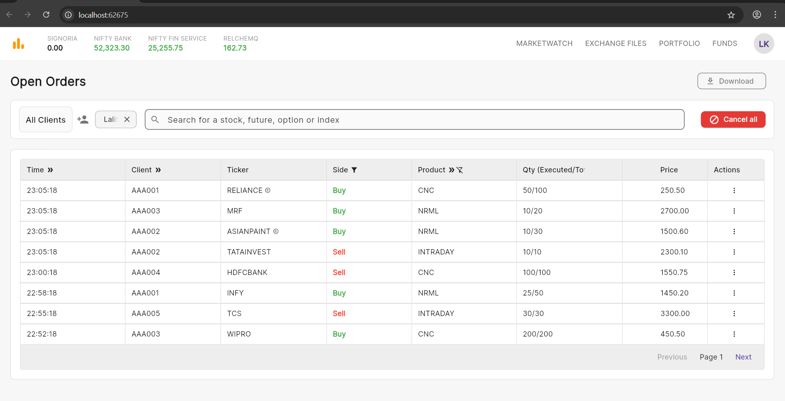

# Flutter Orders Dashboard Assignment
This project is a Flutter application developed as an assignment to replicate a complex financial dashboard UI. The application displays a list of open orders in a data table and includes functionality for sorting, filtering, searching, pagination, and performing actions on the orders. The focus was on creating a clean, maintainable, and scalable application architecture while achieving a pixel-perfect UI match with the provided design.

## Screenshots
### Final Application UI:


#### Basic working video watch in youtube

[](https://youtu.be/xvheJGBHKno)


### Target Design:
.png>)
### Features
The application implements the following key features:
- **Dynamic Data Table: ** Displays a list of orders with columns for Time, Client, Ticker, Side, Product, Quantity, Price, and Actions.
- ** Sorting: ** Users can sort the data by Time, Client, and Product type in both ascending and descending order by clicking the column headers.
- * Advanced Filtering: *
    - Filter by Client: A dropdown menu allows users to view orders for a specific client.
    - Filter by Ticker: Clicking the info icon next to a ticker symbol adds it as a filter chip. Multiple tickers can be selected.
    - Clear Filters: Filters for both clients and tickers can be easily removed.
    - Live Search: A search bar allows users to instantly filter the table by Ticker or Client ID.
- Pagination: The data table is paginated to handle a large number of orders efficiently. Users can navigate between pages using "Previous" and "Next" buttons.
- Order Actions:
    - Delete Order: Each order has a "Delete" option in a popup menu.
    - Cancel All: A prominent button allows for the cancellation (clearing) of all orders from the list.
- Data Export: A "Download" button simulates exporting the currently filtered data.
- Responsive Layout: The UI is designed to be responsive and adapt to different screen sizes, particularly for web and desktop layouts.
### Project Structure
The project is organized into a clean and logical directory structure to promote separation of concerns and maintainability.
```
lib/
├── main.dart             # App entry point, theme, and routing
├── controllers/
│   └── order_controller.dart # State management, business logic
├── data/
│   └── mock_data.dart    # Mock data for the orders
├── models/
│   └── order_model.dart  # Data model for an Order
└── screens/              # (Implicitly in main.dart for this project)
    └── orders_screen.dart  # Main UI screen and its components
```

- models: Contains the Order data class, which defines the structure of an order object.
- data: Holds the mock_data.dart file, providing a static list of orders to populate the app. This decouples the UI from the data source.
- controllers: Contains the OrderController. This class handles all the state management and business logic.
- main.dart: The entry point of the app. It sets up the ChangeNotifierProvider for state management and defines the main UI widgets (OrdersScreen, FilterSection, OpenOrdersTable, etc.).
### State Management
This project uses the Provider package (provider) for state management.
- ChangeNotifier & ChangeNotifierProvider: The OrderController class extends ChangeNotifier. It holds the application's state (the list of orders, filter settings, sort order, etc.) and the business logic to manipulate that state.
- context.watch<T>() & context.read<T>(): Widgets listen for changes in the OrderController using context.watch<OrderController>(). This ensures that the UI rebuilds automatically whenever the data changes (e.g., after applying a filter). For one-off actions that modify the state but don't require the widget to rebuild (like button presses), context.read<OrderController>() is used to call methods on the controller.
This approach centralizes the application's logic, making the UI widgets purely presentational and easier to manage.
### Installation and Setup
To run this project locally, follow these steps:
- Clone the repository
- Ensure you have Flutter installed. If not, follow the official Flutter installation guide.
#### Install dependencies:
Open the project in your terminal and run:
``` flutter pub get ```

Run the application:
You can run the app on Chrome (for a web view) or any configured emulator/device.
# To run on Chrome (recommended for this layout)
flutter run -d chrome

# To run on a mobile emulator/device
flutter run


#### Dependencies
This project relies on the following packages:
provider: For state management.
- google_fonts: To use the "Inter" font for a professional look.
- intl: For formatting dates and times (e.g., the HH:mm:ss format).
All dependencies are listed in the pubspec.yaml file.
